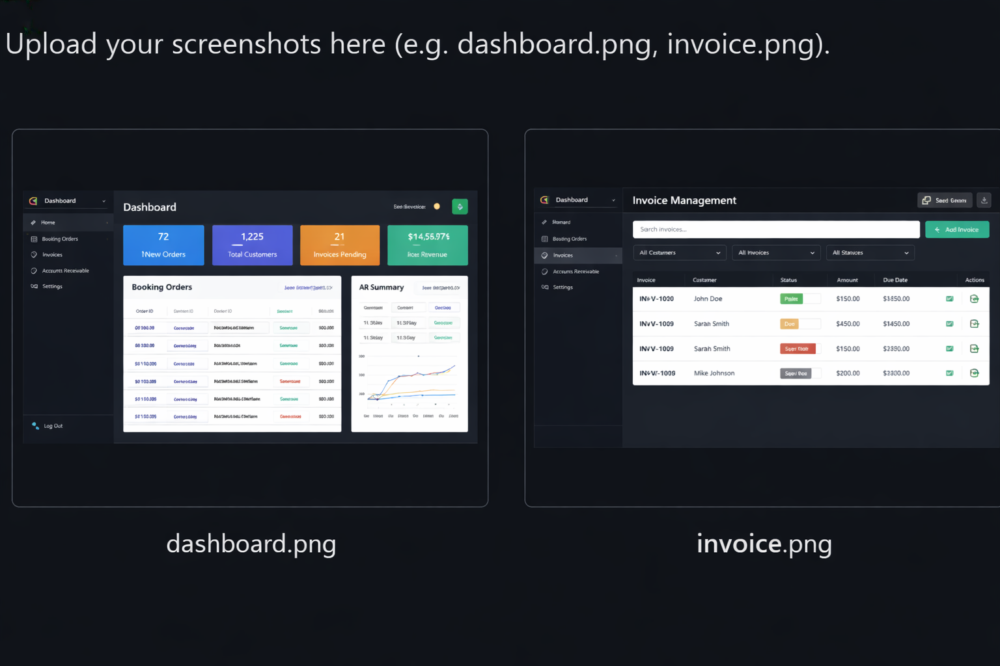

# Smart Online Service Booking System
Full Stack Development project simulating an admin panel for online service bookings, invoice management, and Accounts Receivable workflows using React, Node.js, and MySQL.
# Smart Online Service Booking

## Overview
This project simulates an admin panel for managing online service bookings, invoicing, and transaction validation. Relevant for billing and Accounts Receivable (AR) processes.

## Features
- Track orders and generate invoices
- Validate booking data (placeholder scripts)
- Dashboard for recurring billing simulation
- Handle customer service requests
- ## Project Screenshots

### Admin Panel Dashboard & Invoices

### UI Screenshot 1

### UI Screenshot 2

## Technologies Used
- Frontend: React (placeholder)
- Backend: Node.js (placeholder)
- Database: MySQL (placeholder)
- Excel scripts for data validation

## How to Run
This is a placeholder project. Full code will be added soon.
