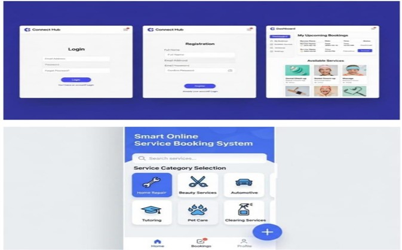
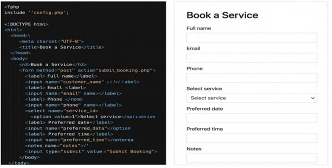

# Smart Online Service Booking System

Full Stack Development project simulating an admin panel for online service bookings, invoice management, and Accounts Receivable workflows using React, Node.js, and MySQL.

GitHub Repository: [Smart Online Service Booking System](https://github.com/varrsa4/Smart-Online-Service-Booking-System-.git)

---

## Table of Contents
- [Overview](#overview)
- [Features](#features)
- [Project Screenshots](#project-screenshots)
- [Technologies Used](#technologies-used)
- [How to Run](#how-to-run)
- [Live Demo](#live-demo)
- [License](#license)

---

## Overview
This project simulates an admin panel for managing online service bookings, invoicing, and transaction validation. Relevant for billing and Accounts Receivable (AR) processes.

## Features
- Track orders and generate invoices
- Validate booking data (placeholder scripts)
- Dashboard for recurring billing simulation
- Handle customer service requests

## Project Screenshots

### Admin Panel Dashboard & Invoices

### UI Screenshot 1

### UI Screenshot 2

## Technologies Used
- Frontend: React (placeholder)
- Backend: Node.js (placeholder)
- Database: MySQL (placeholder)
- Excel scripts for data validation

## How to Run
This is a placeholder project. Full code will be added soon.

## Live Demo
[Add your live demo link here](#)

## License
This project is licensed under the MIT License. See the [LICENSE](LICENSE) file for details.

